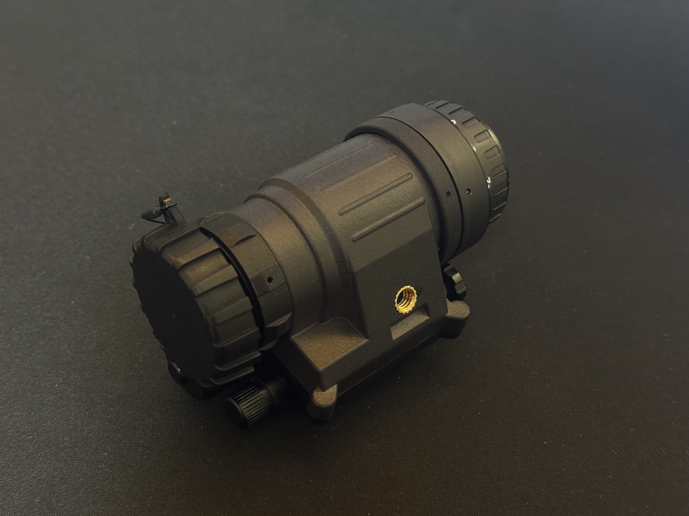

# OpenPVS14
https://www.printables.com/model/1706684-openpvs14

Open-source DIY PVS-14 compatible housing.

Works well with MJF printing—optimized for PA12S, but PA12 may also work. 
The upper part in the first photo is printed one.

Currently only Chinese(EON/Norinco) version exists, not sure if US originals (Carson, ITT, etc) will fit.  
Will update once I get a US housing.  
If possible, I also plan to add versions with a purge screw and IR light.

PCB is currently in development, but since I'm new to pcb design, not sure when it will be finished—or if it can even be finished at all.

# BOM (Bill of Materials)
| Part | Qty |
| :--- | :--- |
| Heat insert (1/4 UNC, OD: 8, L: 5) | 1 |
| Heat insert (M2, OD: 3.2, L < 4) | 4 |
| M2 SHCS (3.5 < L < 7) | 4 |